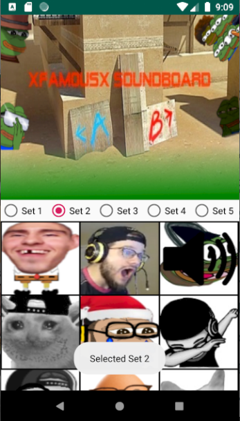

# SoundBoardApp
- Small and simple Android soundboard I did inspired on [xfam0usx](https://www.twitch.tv/cfnafamous) streams in the summer of 2019. 
- Done with lots of repetitive and lazy coding at the time lol, but I fixed it by dynamically setting the audios the buttons have, based on the mp3's found with the same file name as the id of the button
___
- Basically it's just 1 activity, with a banner (ImageView)
- A RadioGroup to select audio segments and a ScrollView filled with ImageViews that are treated as buttons
- Each button has an image related to the audio's context or topic
- Each button "holds" more audios that others, thus, everytime a new "set" of audio is selected on the RadioGroup, if there's no audio for that number of set, the buttons is disabled and turns black and white
- When the button is pressed, the button will have a speaker icon on top of it

## Demo
<video width="630" height="300" src="Documentation/demo.mp4"></video>

## How to build
- gradlew assembleDebug
- .apk will be in [/app/build/outputs/apk/debug/](./App/app/build/outputs/apk/debug/)